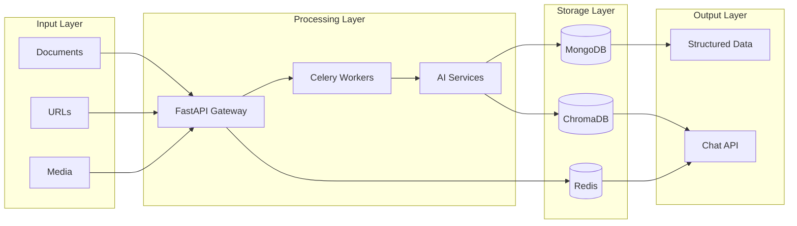
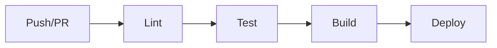

# DocuMind

[](https://www.python.org/downloads/)
[](https://opensource.org/licenses/MIT)
[](https://github.com/psf/black)
[](https://fastapi.tiangolo.com/)
[](https://www.docker.com/)

**Intelligent Document Extraction & Intelligence Platform**

DocuMind is an enterprise-grade document processing pipeline that transforms unstructured data—files, URLs, and multimedia content—into structured, queryable intelligence. The platform leverages advanced OCR, Vision-Language Models (VLM), and Large Language Models (LLM) to extract, analyze, and index information for Retrieval-Augmented Generation (RAG) workflows.

---

## Table of Contents

- [Overview](#overview)
- [Key Features](#key-features)
- [Architecture](#architecture)
- [Technology Stack](#technology-stack)
- [Getting Started](#getting-started)
- [Running the Application](#running-the-application)
- [Testing](#testing)
- [CI/CD Pipeline](#cicd-pipeline)
- [API Reference](#api-reference)
- [Documentation](#documentation)
- [Contributing](#contributing)
- [License](#license)

---

## Overview

DocuMind addresses the challenge of extracting actionable insights from diverse document formats. Whether processing PDFs, images, spreadsheets, or multimedia files, the platform provides a unified API for document intelligence with semantic search capabilities.

### Quick Start

```bash
# Upload a document
curl -X POST "http://localhost:8000/api/v1/extract" -F "file=@document.pdf"

# Query processed documents
curl -X POST "http://localhost:8000/api/v1/chat" \
  -H "Content-Type: application/json" \
  -d '{"query": "Summarize the key findings", "session_id": "session-001"}'
```

---

## Key Features

| Feature | Description |
|---------|-------------|
| **Universal Input Support** | Process PDF, DOCX, PPTX, XLSX, CSV, TXT, images, audio, and video files |
| **Intelligent Vision Pipeline** | Hybrid OCR/VLM with automatic fallback for complex visual content |
| **Semantic Caching** | Redis-based caching layer reducing query latency by up to 80% |
| **Real-Time Streaming** | Server-Sent Events (SSE) for interactive chat responses |
| **Structured Extraction** | LLM-powered parsing of unstructured text into JSON schemas |
| **Scalable Architecture** | Distributed processing via FastAPI and Celery |

---

## Architecture



**Design Pattern**: Controller-Service-Repository architecture with asynchronous task processing.

For detailed architecture documentation, see [docs/architecture.md](docs/architecture.md).

---

## Technology Stack

| Category | Technologies |
|----------|--------------|
| **API Framework** | FastAPI |
| **Task Queue** | Celery, Redis |
| **Databases** | MongoDB (metadata), ChromaDB (vectors) |
| **AI/ML** | LangChain, Ollama, PaddleOCR, OpenAI Whisper |
| **Containerization** | Docker, Docker Compose |

---

## Performance Metrics

| Operation | Average Time |
|-----------|-------------|
| PDF Processing (10 pages) | 2-5 seconds |
| Image OCR | 1-3 seconds |
| Cached Query Response | < 50ms |
| Document Indexing | < 1 second |

---

## Getting Started

### Prerequisites

- Python 3.10 or higher
- Docker and Docker Compose
- Ollama (for local LLM inference)

### Installation

1. **Clone the repository**
   ```bash
   git clone https://github.com/Mohammed-saber1/DocuMind.git
   cd DocuMind
   ```

2. **Configure environment variables**
   ```bash
   cp src/.env.example src/.env
   # Edit src/.env with your API keys and configuration
   ```

3. **Start infrastructure services**
   ```bash
   docker-compose -f docker/docker-compose.yml up -d
   ```

4. **Install Python dependencies**
   ```bash
   python -m venv venv
   source venv/bin/activate  # Windows: venv\Scripts\activate
   pip install -r src/requirements.txt
   ```

---

## Running the Application

### Development Mode

Start the API server:
```bash
uvicorn src.main:app --host 0.0.0.0 --port 8000 --reload
```

Start the Celery worker (separate terminal):
```bash
cd src
celery -A worker.celery_app worker --loglevel=info -Q extraction_queue
```

Start the Streamlit frontend (optional):
```bash
cd streamlit_app
streamlit run app.py
```

### Production Mode (Docker)

```bash
docker build -f docker/Dockerfile -t documind:latest .
docker run -p 8000:8000 documind:latest
```

### Accessing the Application

| Service | URL |
|---------|-----|
| API Documentation (Swagger) | http://localhost:8000/docs |
| API Documentation (ReDoc) | http://localhost:8000/redoc |
| Streamlit UI | http://localhost:8501 |

---

## Testing

### Running Unit Tests

```bash
# Install development dependencies
pip install -r requirements-dev.txt

# Run all tests
pytest tests/ -v

# Run with coverage report
pytest tests/ -v --cov=src --cov-report=term-missing

# Run specific test file
pytest tests/unit/test_services.py -v
```

### Test Structure

```
tests/
├── conftest.py          # Shared fixtures and configuration
├── unit/
│   ├── test_services.py # Service layer unit tests
│   └── test_extractors.py # Extractor unit tests
└── integration/         # Integration tests (API endpoints)
```

### Writing Tests

Tests use pytest with async support. Example:

```python
import pytest

class TestCacheService:
    def test_cache_key_generation(self):
        """Verify cache keys are generated deterministically."""
        key1 = generate_cache_key("query", "session-1")
        key2 = generate_cache_key("query", "session-1")
        assert key1 == key2
```

---

## CI/CD Pipeline

### Overview

The project uses GitHub Actions for continuous integration and deployment. The pipeline runs automatically on:
- Push to `main` or `develop` branches
- Pull requests targeting `main`

### Pipeline Stages



| Stage | Description |
|-------|-------------|
| **Lint** | Code formatting (Black), import sorting (isort), linting (Flake8) |
| **Test** | Unit tests with pytest, coverage reporting to Codecov |
| **Build** | Docker image build and push to GitHub Container Registry |
| **Deploy** | (Optional) Deployment to staging/production environments |

### Workflow Files

- [`.github/workflows/ci.yml`](.github/workflows/ci.yml) - Main CI pipeline
- [`.github/workflows/docker.yml`](.github/workflows/docker.yml) - Docker image build

### Running CI Locally

```bash
# Install pre-commit hooks
pip install pre-commit
pre-commit install

# Run all checks manually
pre-commit run --all-files
```

---

## Project Structure

```
DocuMind/
├── .github/workflows/   # CI/CD pipeline definitions
├── docs/                # Technical documentation
├── docker/              # Docker configuration
├── examples/            # Usage examples
├── src/
│   ├── controllers/     # API request handlers
│   ├── extractors/      # Format-specific document extractors
│   ├── models/          # Pydantic models and schemas
│   ├── pipeline/        # Document processing workflow
│   ├── routes/          # API endpoint definitions
│   ├── services/        # Business logic layer
│   ├── worker/          # Celery task definitions
│   └── main.py          # Application entry point
├── streamlit_app/       # Frontend application
├── tests/               # Test suite
├── CONTRIBUTING.md      # Contribution guidelines
├── CHANGELOG.md         # Version history
└── SECURITY.md          # Security policy
```

---

## Use Cases

### Enterprise Document Intelligence
Process contracts, reports, and invoices at scale. Extract key terms, dates, and figures automatically while enabling natural language queries across document repositories.

### Research and Analysis
Upload research papers and technical documents. Extract citations, summarize findings, and synthesize information across multiple sources.

### Multi-Modal Content Processing
Process training videos, presentation slides, and mixed media content. Combine insights from multiple formats into a unified knowledge base.

### Knowledge Base Development
Index product documentation, FAQs, and support materials. Enable rapid information retrieval through semantic search with real-time response streaming.

---

## Documentation

| Document | Description |
|----------|-------------|
| [Architecture Guide](docs/architecture.md) | System design and component overview |
| [API Reference](docs/api-reference.md) | Complete endpoint documentation |
| [Deployment Guide](docs/deployment.md) | AWS, GCP, and Azure deployment |
| [Performance Tuning](docs/performance-tuning.md) | Optimization strategies |
| [Contributing](CONTRIBUTING.md) | Contribution guidelines |

---

## Technical Highlights

- **Microservices Architecture**: FastAPI with Celery for distributed task processing
- **Multi-Modal AI Pipeline**: Hybrid OCR/VLM with intelligent fallback mechanisms
- **Performance Optimization**: Semantic caching achieving 80%+ latency reduction
- **Vector Search Integration**: ChromaDB for semantic document retrieval
- **Real-Time Communication**: Server-Sent Events for streaming responses
- **Container-Ready**: Docker Compose orchestration with health monitoring
- **Quality Assurance**: Comprehensive test suite with automated CI/CD pipeline

---

## Contributing

Contributions are welcome. Please read our [Contributing Guidelines](CONTRIBUTING.md) before submitting a pull request.

---

## License

This project is licensed under the MIT License. See the [LICENSE](LICENSE) file for details.

---

## Contact

**Mohammed Saber**

- Email: [mohammed.saber.business@gmail.com](mailto:mohammed.saber.business@gmail.com)
- LinkedIn: [linkedin.com/in/mohamedsaber14](https://www.linkedin.com/in/mohamedsaber14/)
