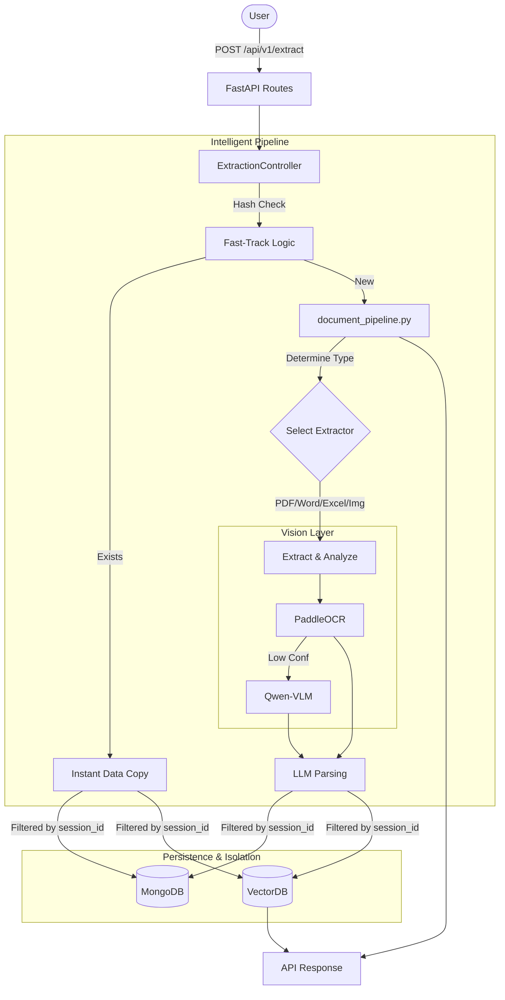

**DocuMind** is an enterprise-grade **Document Extraction and Analysis Pipeline**.
It automatically ingests documents (PDF, DOCX, XLSX, Images), extracts text and visual data using AI (OCR + VLM), structures the output, and stores it in a database for search or downstream processing.

---

## 🌟 Key Features & Intelligence (Latest Updates)

-   **🔒 Session-Based RAG Isolation**: Every session is an isolated island. Users only retrieve and chat with data from their specific `session_id`.
-   **⚡ Smart Fast-Track Indexing**: Duplicate files are detected globally via hashing. Re-uploads bypass OCR, VLM, and Parsing, instantly copying existing data to the new session in **<1s**.
-   **🧠 Hybrid Vision Logic**: OCR-first approach with automatic VLM (Vision Language Model) fallback for low-confidence or complex images.
-   **🧹 Cleaned Context RAG**: Uses LLM-sanitized content for RAG to ensure high-accuracy retrieval, bypassing document noise (page numbers, footers).
-   **📊 Specialized Excel RAG**: Implements row-based chunking for spreadsheets to maintain data integrity and enable complex table queries.
-   **🗑️ Flexible Management**: API support for deleting single files or entire sessions (cleanup both MongoDB and VectorDB).

---

## 🗺️ Project Workflow (The Big Picture)

1.  **Ingestion**: User uploads a file via `/api/v1/extract`.
2.  **Deduplication (Fast-Track)**:
    -   Calculate `file_hash`.
    -   If exists globally: **Instant Copy** of chunks & records. **Early Exit**. ⚡
3.  **Extraction**: If new, `document_pipeline` calls the specific **Extractor** (PDF, Word, Excel, etc.).
4.  **Smart Analysis**:
    -   **OCR**: Extract text from images using PaddleOCR.
    -   **VLM**: If OCR confidence is low, Qwen-VL generates a descriptive caption.
5.  **Structuring**: LLM Agent (`llm_service`) generates a standardized `structured.json`.
6.  **Persistence**:
    -   **MongoDB**: Save structured records with Session & Hash metadata.
    -   **VectorDB**: Chunk and embed `clean_content` for RAG.
7.  **Output**: Returns extraction summary with `fast_tracked` status and MongoDB ID.

---

## 📊 Workflow Diagram



---

## 🔌 API Endpoints & Integration

The API provides both synchronous and asynchronous endpoints for document extraction, RAG-powered chat, and document management.

### 1. Document Extraction (Async)
**Endpoint:** `POST /api/v1/extract/`  
**Description:** Uploads documents and queues them for asynchronous extraction. Supports PDF, DOCX, XLSX, images, and more. Returns immediately with a task ID, then sends results to a callback URL.

**Request Example:**
```bash
curl -X POST "http://localhost:8002/api/v1/extract/" \
  -F "files=@report.pdf" \
  -F "files=@data.xlsx" \
  -F "author=John Doe" \
  -F "use_ocr_vlm=true" \
  -F "session_id=session-abc-123" \
  -F "user_description=Q4 Financial Reports" \
  -F "callback_url=https://your-backend.com/api/extraction-callback"
```

**Response Example (HTTP 200):**
```json
{
  "status": "queued",
  "task_id": "celery-task-uuid-12345",
  "session_id": "session-abc-123",
  "message": "Files uploaded and extraction queued."
}
```

**Callback Result (sent to `callback_url` or `BACKEND_CALLBACK_URL`):**
```json
{
  "session_id": "session-abc-123",
  "batch_mongo_id": "67890abcdef",
  "processed_count": 2,
  "documents": [
    {
      "filename": "report.pdf",
      "source_id": "src-pdf-001",
      "status": "success",
      "error": null
    },
    {
      "filename": "data.xlsx",
      "source_id": "src-xlsx-002",
      "status": "success",
      "error": null
    }
  ]
}
```

---

### 2. Chat with Documents (RAG)
**Endpoint:** `POST /api/v1/chat/`  
**Description:** Ask questions about your indexed documents. Uses RAG to retrieve relevant context and generate AI-powered answers.

**Request Example:**
```json
{
  "message": "What were the key findings in the Q4 financial report?",
  "session_id": "session-abc-123",
  "source_id": null,
  "k": 4,
  "use_history": true
}
```

**Response Example:**
```json
{
  "answer": "Based on the Q4 financial report, the key findings include:\n\n1. **Revenue Growth**: Total revenue increased by 23% YoY to $4.2M\n2. **Profit Margins**: Operating margin improved from 18% to 22%\n3. **Customer Acquisition**: New customer signups grew 35%\n4. **Challenges**: Supply chain costs increased by 12%\n\nThe report emphasizes strong performance in digital channels and recommends continued investment in automation.",
  "sources": [
    "report.pdf (Page 3)",
    "report.pdf (Page 7)",
    "data.xlsx (Sheet: Summary)"
  ],
  "session_id": "session-abc-123",
  "context_found": true,
  "error": false
}
```

---

### 3. Streaming Chat
**Endpoint:** `POST /api/v1/chat/stream`  
**Description:** Same as chat endpoint but streams the response token-by-token using Server-Sent Events (SSE) for real-time user experience.

**Request Example:**
```json
{
  "message": "Summarize the main risks mentioned in the documents",
  "session_id": "session-abc-123",
  "k": 5,
  "use_history": true
}
```

**Response Format (SSE Stream):**
```
data: Based
data:  on
data:  the
data:  documents
data: ,
data:  the
data:  main
data:  risks
data:  include
data: ...
data: [DONE]
```

---

### 4. Get Chat History
**Endpoint:** `GET /api/v1/chat/history/{session_id}`  
**Description:** Retrieve conversation history for a specific session.

**Request Example:**
```bash
curl "http://localhost:8002/api/v1/chat/history/session-abc-123"
```

**Response Example:**
```json
{
  "session_id": "session-abc-123",
  "history": [
    {
      "role": "user",
      "content": "What were the key findings in the Q4 financial report?",
      "timestamp": "2026-01-22T12:30:00Z"
    },
    {
      "role": "assistant",
      "content": "Based on the Q4 financial report, the key findings include...",
      "timestamp": "2026-01-22T12:30:05Z"
    }
  ],
  "message_count": 2
}
```

---

### 5. Clear Chat History
**Endpoint:** `DELETE /api/v1/chat/history/{session_id}`  
**Description:** Delete all conversation history for a session.

**Request Example:**
```bash
curl -X DELETE "http://localhost:8002/api/v1/chat/history/session-abc-123"
```

**Response Example:**
```json
{
  "success": true,
  "session_id": "session-abc-123",
  "message": "Chat history cleared successfully"
}
```

---

### 6. Delete Document or Session
**Endpoint:** `DELETE /api/v1/documents/`  
**Description:** Delete a single document (if `source_id` provided) or an entire session (if `source_id` is omitted). Removes data from both MongoDB and ChromaDB.

**Request Example (Delete Single File):**
```bash
curl -X DELETE "http://localhost:8002/api/v1/documents/?session_id=session-abc-123&source_id=src-pdf-001"
```

**Response Example:**
```json
{
  "session_id": "session-abc-123",
  "source_id": "src-pdf-001",
  "mode": "single_file",
  "chromadb": {
    "success": true,
    "deleted_count": 47,
    "message": "Deleted 47 chunks for source src-pdf-001"
  },
  "mongodb": {
    "success": true,
    "deleted_count": 1,
    "message": "File deleted from session"
  },
  "success": true
}
```

**Request Example (Delete Entire Session):**
```bash
curl -X DELETE "http://localhost:8002/api/v1/documents/?session_id=session-abc-123"
```

**Response Example:**
```json
{
  "session_id": "session-abc-123",
  "source_id": null,
  "mode": "full_session",
  "chromadb": {
    "success": true,
    "deleted_count": 152,
    "message": "Deleted 152 chunks for session session-abc-123"
  },
  "mongodb": {
    "success": true,
    "deleted_count": 1,
    "message": "Session deleted completely"
  },
  "success": true
}
```

---

### 7. List Indexed Documents
**Endpoint:** `GET /api/v1/documents/`  
**Description:** Get a summary of all documents indexed in ChromaDB.

**Request Example:**
```bash
curl "http://localhost:8002/api/v1/documents/"
```

**Response Example:**
```json
{
  "total_chunks": 152,
  "total_sessions": 3,
  "sessions": [
    {
      "session_id": "session-abc-123",
      "chunk_count": 89,
      "sources": ["report.pdf", "data.xlsx"]
    },
    {
      "session_id": "session-xyz-456",
      "chunk_count": 63,
      "sources": ["presentation.pptx"]
    }
  ]
}
```

---

## 📂 Project Structure & File Guide

This section explains **every** significant file and folder in the `src/` directory.

### `src/` (Root Source)
*   **`main.py`**: The application entry point. Initializes FastAPI, database connections, and registers routes.
*   **`requirements.txt`**: List of Python dependencies.

#### `src/assets/`
*   **`files/`**: Where extracted images are saved. Files are renamed with `session_id` prefixes.
*   **`memories/`**: Persistent storage for ChromaDB (Vector Search).

#### `src/controllers/`
*   **`BaseController.py`**: Shared logic for all controllers (e.g., temp directory management).
*   **`ExtractionController.py`**: Manages the extraction lifecycle, handling uploads, session IDs, and result aggregation.

#### `src/extractors/`
*   **`pdf_extractor.py`**: Fast text/image extraction (PyMuPDF) and precise table extraction (pdfplumber).
*   **`word_extractor.py`**: Extracts text, tables, and images from `.docx` files.
*   **`image_extractor.py`**: Prepares raw images for OCR/VLM.
*   **`excel_extractor.py`**: Row-based extraction for `.xlsx` and `.csv` optimized for RAG.
*   **`ppt_extractor.py`**: Handles PowerPoint presentations.

#### `src/services/` (The "Brains")
*   **`ocr_service.py`**: PaddleOCR wrapper for high-speed text extraction from images.
*   **`vlm_service.py`**: Vision Language Model (Qwen-VL) for descriptive image analysis.
*   **`llm_service.py`**: Structuring agent that generates the final `clean_content` and JSON.
*   **`db_service.py`**: MongoDB management; handles session persistence and deletion.
*   **`rag_service.py`**: Logic for preparing and chunking documents for search.
*   **`memory_service.py`**: VectorDB interface; handles session-scoped retrieval and hash-deduplication.

#### `src/helpers/` (Utilities)
*   **`config.py`**: Environment configuration.
*   **`file_utils.py`**: File I/O and hashing helpers.
*   **`table_utils.py`**: Markdown formatting for tables.
*   **`text_utils.py`**: Text cleaning and sanitization.

#### `src/routes/` (API Endpoints)
*   **`extraction.py`**: Main extraction API (`POST /api/v1/extract`).
*   **`documents_delete.py`**: Flexible deletion support (Single File vs Full Session).
*   **`chat.py`**: Session-isolated RAG chat.
*   **`schemes/`**: Request/Response models.

#### `src/pipeline/`
*   **`document_pipeline.py`**: **CORE ENGINE**. Orchestrates everything from Fast-Track checks to final indexing.

---
*Documentation maintained by DocuMind Team*
