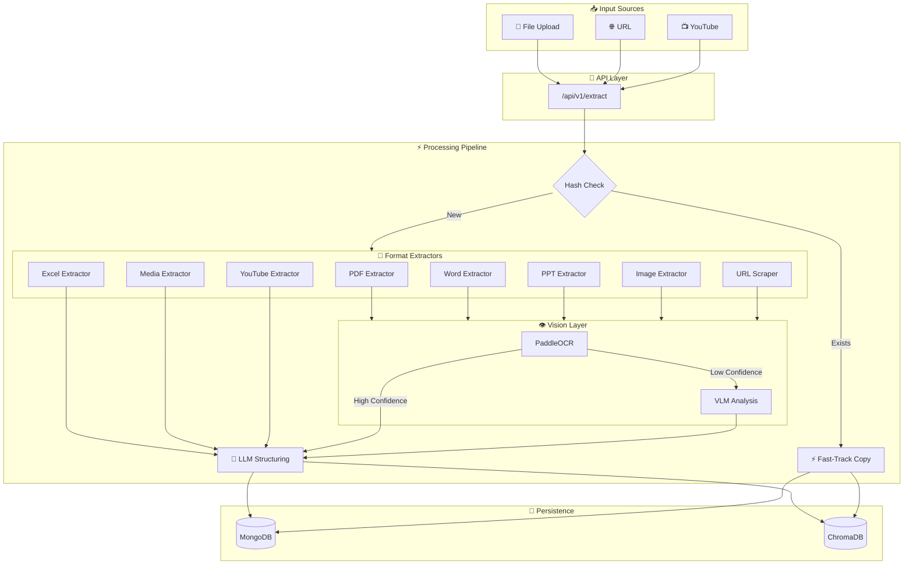
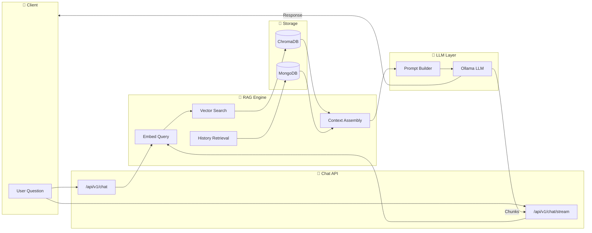
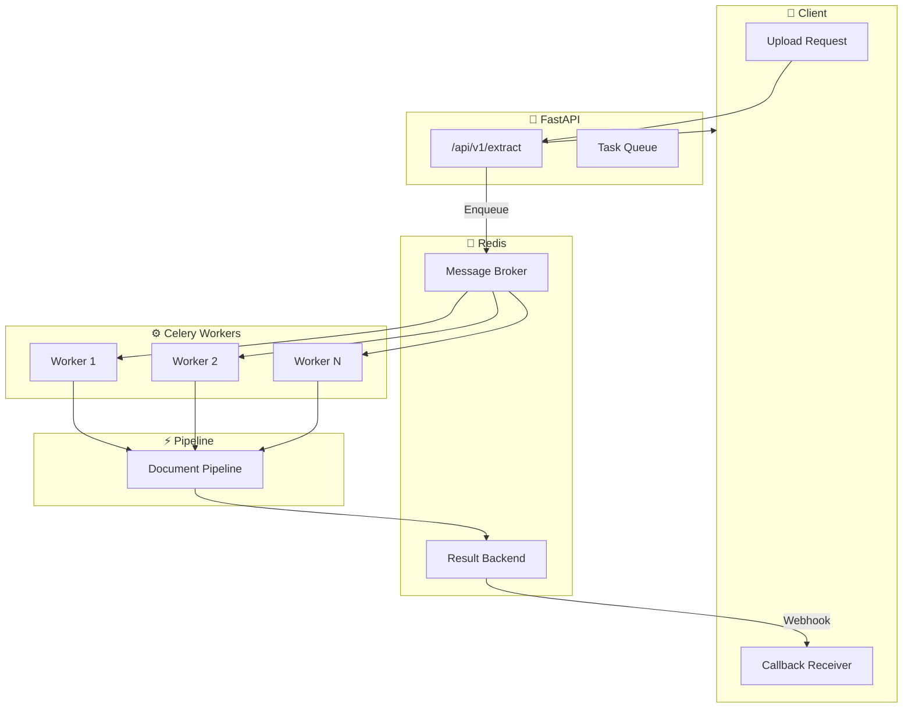
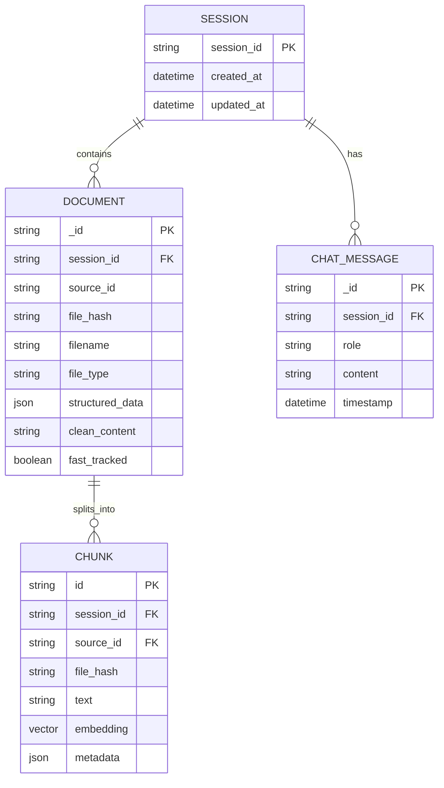

<p align="center">
  
  
  
  
  
</p>

<h1 align="center">🧠 DocuMind</h1>

<p align="center">
  <strong>Enterprise-Grade Intelligent Document Extraction & RAG Pipeline</strong>
</p>

<p align="center">
  An AI-powered system that ingests multi-format documents, extracts structured content using hybrid OCR + Vision Language Models, and enables conversational knowledge retrieval through RAG.
</p>

---

## 📋 Table of Contents

- [Project Overview](#-project-overview)
- [Key Features](#-key-features)
- [Architecture](#-architecture)
- [System Diagrams](#-system-diagrams)
- [API Reference](#-api-reference)
- [Project Structure](#-project-structure)
- [Installation](#-installation)
- [Configuration](#-configuration)
- [Usage Examples](#-usage-examples)

---

## 🎯 Project Overview

### What is DocuMind?

**DocuMind**  is an enterprise-grade **Document Extraction and Analysis Pipeline** that transforms unstructured documents into searchable, structured knowledge. It combines cutting-edge AI technologies to provide:

- **Intelligent Document Ingestion** – Automatically processes PDF, DOCX, XLSX, PPTX, Images, Audio, Video, URLs, and YouTube content
- **Hybrid Vision AI** – Uses OCR (PaddleOCR) with automatic VLM fallback (Groq/Mistral/Local) for maximum extraction accuracy
- **RAG-Powered Chat** – Enables natural language Q&A over your document corpus with context-aware responses
- **Session Isolation** – Complete data isolation per session for multi-tenant deployments
- **Async Processing** – Celery-based background processing with Redis for high-throughput scenarios

### Problem It Solves

Organizations struggle with:
- **Information Silos** – Critical knowledge locked in PDFs, spreadsheets, and presentations
- **Manual Data Entry** – Time-consuming extraction of text, tables, and charts from documents
- **Search Inefficiency** – Traditional keyword search fails on scanned documents and images
- **Scale Challenges** – Processing thousands of documents without bottlenecks

**DocuMind** automates the entire pipeline from ingestion to intelligent retrieval.

### Target Users

| User Type | Use Case |
|-----------|----------|
| **Enterprises** | Internal knowledge bases, compliance document search, contract analysis |
| **Legal Teams** | Case document analysis, evidence extraction, contract review |
| **Research Organizations** | Literature review, data extraction from papers |
| **Healthcare** | Patient record processing, medical document OCR |
| **Finance** | Invoice processing, financial report extraction, audit trails |

---

## ✨ Key Features

### 📄 Document Processing

| Feature | Description |
|---------|-------------|
| **Multi-Format Support** | PDF, DOCX, XLSX, CSV, PPTX, Images (PNG/JPG/WEBP), Audio, Video |
| **Smart PDF Extraction** | Dual-engine: PyMuPDF for fast text + pdfplumber for precise tables |
| **Excel Intelligence** | Row-based chunking preserves table structure for accurate RAG queries |
| **PowerPoint Processing** | Extracts text, notes, and embedded images from slides |
| **Image Extraction** | Automatic extraction of embedded images from all document types |

### 🖼️ Vision & OCR

| Feature | Description |
|---------|-------------|
| **PaddleOCR Integration** | High-speed multilingual OCR (English, Arabic, 80+ languages) |
| **VLM Fallback** | Automatic Vision Language Model analysis for low-confidence OCR |
| **Multi-Provider VLM** | Supports Groq (Llama 4), Mistral (Pixtral), and local models |
| **Chart/Graph Detection** | Intelligent detection and description of visual elements |

### 🎬 Media Processing

| Feature | Description |
|---------|-------------|
| **YouTube Integration** | Download and transcribe YouTube videos via yt-dlp |
| **Audio Transcription** | OpenAI Whisper (multiple model sizes) for accurate speech-to-text |
| **Video Processing** | FFmpeg-powered extraction from MP4, MKV, AVI, MOV, and more |
| **URL Scraping** | BeautifulSoup-based web content extraction with image download |

### 🤖 AI & RAG

| Feature | Description |
|---------|-------------|
| **LLM-Powered Parsing** | Structured JSON output via Ollama (Qwen, Llama, etc.) |
| **Semantic Chunking** | Intelligent text splitting for optimal retrieval |
| **ChromaDB Vectors** | Persistent vector storage with Nomic embeddings |
| **Contextual Chat** | RAG-powered Q&A with conversation history |
| **Streaming Responses** | Real-time SSE streaming for chat responses |

### ⚡ Performance & Infrastructure

| Feature | Description |
|---------|-------------|
| **Smart Fast-Track** | SHA-256 hash deduplication – instant reuse of processed files |
| **Session Isolation** | Complete data isolation per `session_id` |
| **Async Workers** | Celery + Redis for background document processing |
| **Callback Webhooks** | Automatic POST to your backend when processing completes |
| **Flexible Deletion** | Delete single files or entire sessions (MongoDB + ChromaDB) |

---

## 🏗️ Architecture

### High-Level Overview

DocuMind follows a **modular pipeline architecture** with clear separation of concerns:

```
┌─────────────────────────────────────────────────────────────────────────────┐
│                              API Layer (FastAPI)                           │
│   /extract  │  /chat  │  /chat/stream  │  /documents  │  /health          │
└──────────────────────────────┬──────────────────────────────────────────────┘
                               │
┌──────────────────────────────▼──────────────────────────────────────────────┐
│                         Controller Layer                                    │
│              ExtractionController  │  ChatService                          │
└──────────────────────────────┬──────────────────────────────────────────────┘
                               │
┌──────────────────────────────▼──────────────────────────────────────────────┐
│                      Document Pipeline (Core Engine)                        │
│  ┌─────────────┐  ┌───────────────┐  ┌─────────────┐  ┌──────────────────┐ │
│  │ Fast-Track  │→ │  Extractors   │→ │ Vision Layer│→ │ LLM Structuring  │ │
│  │  (Hash)     │  │ PDF/Word/etc  │  │ OCR + VLM   │  │ JSON Generation  │ │
│  └─────────────┘  └───────────────┘  └─────────────┘  └──────────────────┘ │
└──────────────────────────────┬──────────────────────────────────────────────┘
                               │
┌──────────────────────────────▼──────────────────────────────────────────────┐
│                         Persistence Layer                                   │
│           MongoDB (Structured Data)  │  ChromaDB (Vector Embeddings)       │
└─────────────────────────────────────────────────────────────────────────────┘
```

### Component Responsibilities

| Component | Location | Responsibility |
|-----------|----------|----------------|
| **main.py** | `src/main.py` | FastAPI app initialization, router registration, lifecycle management |
| **Routes** | `src/routes/` | HTTP endpoints for extraction, chat, documents, health |
| **Controllers** | `src/controllers/` | Business logic orchestration, request handling |
| **Pipeline** | `src/pipeline/` | **Core engine**: file routing, hash checks, extraction orchestration |
| **Extractors** | `src/extractors/` | Format-specific extraction: PDF, Word, Excel, PPT, Image, URL, YouTube, Media |
| **Services** | `src/services/` | AI services: OCR, VLM, LLM, RAG, Memory, Chat, Database |
| **Stores** | `src/stores/` | Abstracted storage: ChromaDB vectors, LLM providers |
| **Worker** | `src/worker/` | Celery async task definitions and configuration |

---

## 📊 System Diagrams

### Document Processing Flow



### RAG Chat Architecture



### Async Processing Architecture



### Data Model & Session Isolation



---

## 🔌 API Reference

### Base URL
```
http://localhost:8005
```

### Endpoints Summary

| Method | Endpoint | Description |
|--------|----------|-------------|
| `POST` | `/api/v1/extract/` | Upload and extract documents (async) |
| `POST` | `/api/v1/chat/` | Chat with indexed documents |
| `POST` | `/api/v1/chat/stream` | Streaming chat responses (SSE) |
| `GET` | `/api/v1/chat/history/{session_id}` | Get conversation history |
| `DELETE` | `/api/v1/chat/history/{session_id}` | Clear conversation history |
| `GET` | `/api/v1/documents/` | List all indexed documents |
| `DELETE` | `/api/v1/documents/` | Delete document or session |
| `GET` | `/health` | Health check |

---

### 1. Document Extraction (Async)

**Endpoint:** `POST /api/v1/extract/`

Upload documents for asynchronous extraction. Supports PDF, DOCX, XLSX, CSV, PPTX, images, and URLs.

**Request:**
```bash
curl -X POST "http://localhost:8005/api/v1/extract/" \
  -F "files=@report.pdf" \
  -F "files=@data.xlsx" \
  -F "author=John Doe" \
  -F "use_ocr_vlm=true" \
  -F "session_id=session-abc-123" \
  -F "user_description=Q4 Financial Reports" \
  -F "callback_url=https://your-backend.com/callback"
```

**Response:**
```json
{
  "status": "queued",
  "task_id": "celery-task-uuid-12345",
  "session_id": "session-abc-123",
  "message": "Files uploaded and extraction queued."
}
```

**Callback Payload (sent to your webhook):**
```json
{
  "session_id": "session-abc-123",
  "batch_mongo_id": "67890abcdef",
  "processed_count": 2,
  "documents": [
    {
      "filename": "report.pdf",
      "source_id": "report.pdf__uuid",
      "status": "success",
      "fast_tracked": false
    }
  ]
}
```

---

### 2. Chat with Documents

**Endpoint:** `POST /api/v1/chat/`

Query your indexed documents using natural language. Returns AI-generated answers with source citations.

**Request:**
```json
{
  "message": "What were the key findings?",
  "session_id": "session-abc-123",
  "source_id": null,
  "k": 4,
  "use_history": true
}
```

**Response:**
```json
{
  "answer": "Based on the documents, the key findings include...",
  "sources": ["report.pdf (Page 3)", "data.xlsx (Sheet: Summary)"],
  "session_id": "session-abc-123",
  "context_found": true
}
```

---

### 3. Streaming Chat

**Endpoint:** `POST /api/v1/chat/stream`

Same as chat but streams responses token-by-token via Server-Sent Events.

**Response Format:**
```
data: Based
data:  on
data:  the
data:  documents
data: ...
data: [DONE]
```

---

### 4. Chat History

**Get History:** `GET /api/v1/chat/history/{session_id}`

```json
{
  "session_id": "session-abc-123",
  "history": [
    {"role": "user", "content": "...", "timestamp": "..."},
    {"role": "assistant", "content": "...", "timestamp": "..."}
  ]
}
```

**Clear History:** `DELETE /api/v1/chat/history/{session_id}`

---

### 5. Document Management

**List Documents:** `GET /api/v1/documents/`

```json
{
  "total_chunks": 152,
  "total_sessions": 3,
  "sessions": [
    {"session_id": "session-abc-123", "chunk_count": 89, "sources": ["report.pdf"]}
  ]
}
```

**Delete Document:** `DELETE /api/v1/documents/?session_id=abc&source_id=xyz`

**Delete Session:** `DELETE /api/v1/documents/?session_id=abc`

---

## 📂 Project Structure

```
DocuMind/
├── 📄 README.md                    # This file
├── 📄 LICENSE                      # MIT License
├── 📄 .env.example                 # Environment template
├── 📄 .gitignore                   # Git ignore rules
│
├── 📁 scripts/                     # Utility scripts
│   ├── clear_and_reindex.py       # Clear and rebuild indexes
│   ├── debug_retrieval.py         # Debug RAG retrieval
│   └── test_*.py                  # Test utilities
│
└── 📁 src/                         # Main source code
    ├── 📄 main.py                  # FastAPI entry point
    ├── 📄 requirements.txt         # Python dependencies
    │
    ├── 📁 config/                  # Configuration
    │   ├── settings.py             # Environment-based settings
    │   └── redis.py                # Redis connection config
    │
    ├── 📁 core/                    # Core utilities
    │   └── config.py               # Settings access layer
    │
    ├── 📁 routes/                  # API endpoints
    │   ├── extraction.py           # /api/v1/extract
    │   ├── chat.py                 # /api/v1/chat
    │   ├── delete.py               # /api/v1/documents
    │   └── health.py               # /health
    │
    ├── 📁 controllers/             # Request handlers
    │   ├── BaseController.py       # Shared controller logic
    │   └── ExtractionController.py # Extraction orchestration
    │
    ├── 📁 pipeline/                # Core processing engine
    │   └── document_pipeline.py    # Main extraction pipeline
    │
    ├── 📁 extractors/              # Format-specific extractors
    │   ├── pdf_extractor.py        # PDF (PyMuPDF + pdfplumber)
    │   ├── word_extractor.py       # DOCX (python-docx)
    │   ├── excel_extractor.py      # XLSX/CSV (openpyxl/pandas)
    │   ├── ppt_extractor.py        # PPTX (python-pptx)
    │   ├── image_extractor.py      # Images (PIL)
    │   ├── url_extractor.py        # Web URLs (BeautifulSoup)
    │   ├── youtube_extractor.py    # YouTube (yt-dlp)
    │   └── media_extractor.py      # Audio/Video (FFmpeg)
    │
    ├── 📁 services/                # AI & infrastructure services
    │   ├── ocr_service.py          # PaddleOCR wrapper
    │   ├── vlm_service.py          # Vision Language Model (Groq/Mistral)
    │   ├── llm_service.py          # LLM structuring (Ollama)
    │   ├── chat_service.py         # RAG chat logic
    │   ├── rag_service.py          # Chunking & preparation
    │   ├── memory_service.py       # ChromaDB operations
    │   ├── db_service.py           # MongoDB operations
    │   ├── media_service.py        # Whisper transcription
    │   └── web_scraper_service.py  # URL scraping
    │
    ├── 📁 stores/                  # Storage abstractions
    │   ├── vectordb/               # ChromaDB clients
    │   └── llm/                    # LLM provider configs
    │
    ├── 📁 models/                  # Data models
    │   ├── db_schemes/             # MongoDB schemas
    │   └── enums/                  # Enumerations
    │
    ├── 📁 schemas/                 # API schemas (Pydantic)
    │
    ├── 📁 utils/                   # Utility functions
    │   ├── file_utils.py           # File I/O, hashing
    │   ├── text_utils.py           # Text cleaning
    │   └── table_utils.py          # Table formatting
    │
    ├── 📁 worker/                  # Celery async workers
    │   ├── celery_app.py           # Celery configuration
    │   └── tasks.py                # Background task definitions
    │
    └── 📁 assets/                  # Runtime storage
        ├── files/                  # Extracted images
        └── memories/               # ChromaDB persistence
```

---

## 🚀 Installation

### Prerequisites

- **Python 3.10+**
- **MongoDB 4.6+**
- **Redis 6+**
- **FFmpeg** (for media processing)
- **Ollama** (for LLM)

### Quick Start

```bash
# Clone the repository
git clone https://github.com/your-org/DocuMind.git
cd DocuMind

# Create virtual environment
python -m venv venv
source venv/bin/activate  # or `venv\Scripts\activate` on Windows

# Install dependencies
pip install -r src/requirements.txt

# Copy environment template
cp .env.example .env
# Edit .env with your configuration

# Start the server
cd src
uvicorn main:app --reload --host 0.0.0.0 --port 8005
```

### Start Celery Worker (Optional - for async processing)

```bash
cd src
celery -A worker.celery_app worker --loglevel=info
```

---

## ⚙️ Configuration

### Environment Variables

| Variable | Default | Description |
|----------|---------|-------------|
| `APP_NAME` | DocuMind | Application name |
| `MONGO_URL` | mongodb://localhost:27017/ | MongoDB connection URL |
| `MONGO_DB` | DocuMind | Database name |
| `REDIS_HOST` | localhost | Redis host |
| `REDIS_PORT` | 6380 | Redis port |
| `LLM_MODEL` | qwen2.5:1.5b | Ollama model name |
| `OLLAMA_BASE_URL` | http://localhost:11434 | Ollama API URL |
| `VLM_API_URL` | (your VLM endpoint) | Vision LLM API URL |
| `VLM_PROVIDER` | groq | VLM provider (groq/mistral/local) |
| `OCR_ENABLED` | true | Enable PaddleOCR |
| `OCR_LANGUAGES` | en,ar | OCR languages |
| `EMBEDDING_MODEL` | nomic-embed-text | Embedding model |
| `CHROMA_DB_DIR` | assets/memories/chroma_db | ChromaDB storage path |

---

## 💡 Usage Examples

### Python Client

```python
import requests

# Extract a document
files = {'files': open('report.pdf', 'rb')}
data = {
    'session_id': 'my-session',
    'use_ocr_vlm': 'true',
    'author': 'John Doe'
}
response = requests.post('http://localhost:8005/api/v1/extract/', files=files, data=data)
print(response.json())

# Chat with documents
chat_data = {
    'message': 'Summarize the main points',
    'session_id': 'my-session',
    'k': 5
}
response = requests.post('http://localhost:8005/api/v1/chat/', json=chat_data)
print(response.json()['answer'])
```

### cURL Examples

```bash
# Health check
curl http://localhost:8005/health

# Upload PDF
curl -X POST "http://localhost:8005/api/v1/extract/" \
  -F "files=@document.pdf" \
  -F "session_id=test-session"

# Ask a question
curl -X POST "http://localhost:8005/api/v1/chat/" \
  -H "Content-Type: application/json" \
  -d '{"message": "What is this document about?", "session_id": "test-session"}'
```

---

## 📜 License

This project is licensed under the **MIT License** - see the [LICENSE](LICENSE) file for details.

---

<p align="center">
  <strong>Built with ❤️ by the DocuMind Team</strong>
</p>
