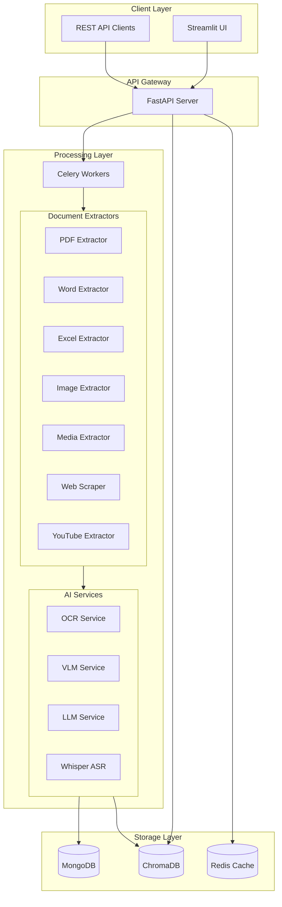
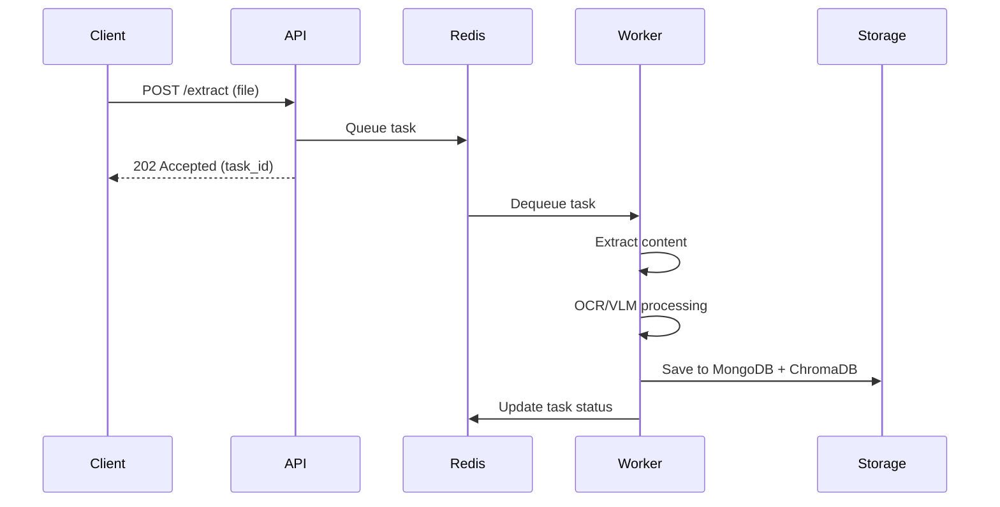
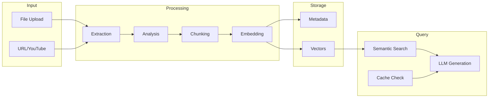

# DocuMind Architecture Deep-Dive

This document provides a comprehensive overview of DocuMind's system architecture, design patterns, and component interactions.

## System Overview

DocuMind is a multi-modal document intelligence platform built on a microservices-inspired architecture. It processes various document types, extracts structured information, and enables intelligent querying through RAG (Retrieval-Augmented Generation).

## Architecture Diagram



## Component Details

### 1. API Layer (FastAPI)

The API layer handles all HTTP requests and provides:
- RESTful endpoints for document processing
- Server-Sent Events (SSE) for streaming responses
- OpenAPI documentation (Swagger/ReDoc)

**Key Endpoints:**
| Endpoint | Method | Description |
|----------|--------|-------------|
| `/api/v1/extract` | POST | Submit document for processing |
| `/api/v1/chat` | POST | Query indexed documents |
| `/api/v1/chat/stream` | POST | Stream chat responses |
| `/api/v1/documents` | GET | List processed documents |

### 2. Processing Layer (Celery)

Asynchronous document processing using Celery with Redis as the message broker.



### 3. Extraction Pipeline

Documents flow through specialized extractors based on file type:

| File Type | Extractor | Processing Method |
|-----------|-----------|-------------------|
| PDF | `pdf_extractor` | PyMuPDF + pdfplumber |
| DOCX | `docx_extractor` | python-docx |
| PPTX | `pptx_extractor` | python-pptx |
| XLSX/XLS | `excel_extractor` | openpyxl + pandas |
| Images | `image_extractor` | OCR → VLM fallback |
| Audio/Video | `media_extractor` | Whisper ASR |
| URLs | `web_scraper` | BeautifulSoup |
| YouTube | `youtube_extractor` | yt-dlp + Whisper |

### 4. AI Services

#### OCR Service
- Primary: PaddleOCR
- Fallback: Tesseract
- Confidence threshold: 0.7

#### VLM Service (Vision-Language Model)
- Triggered when OCR confidence < threshold
- Handles complex images, diagrams, charts
- Providers: Mistral, Groq

#### LLM Service
- Document structuring and summarization
- RAG response generation
- Configurable models via environment

### 5. Storage Layer

#### MongoDB
- Document metadata storage
- Processing status tracking
- User session management

#### ChromaDB
- Vector embeddings for semantic search
- Chunked document storage
- Collection per session/user

#### Redis
- Semantic cache for query responses
- Celery message broker
- Session state management

## Data Flow



## Design Patterns

### Controller-Service-Repository Pattern
```
Controllers (API) → Services (Business Logic) → Repositories (Data Access)
```

### Async Task Processing
All heavy processing is offloaded to Celery workers, keeping the API responsive.

### Semantic Caching
Two-tier caching strategy:
1. **Exact match**: Hash-based key lookup
2. **Semantic match**: Vector similarity search

## Configuration

All configuration is managed through environment variables and the `Settings` class:

```python
# Core settings structure
Settings
├── app_name, app_version
├── MongoSettings (url, db_name)
├── RedisSettings (host, port)
├── LLMSettings (model, temperature)
├── VLMSettings (provider, api_key)
└── OCRSettings (confidence_threshold)
```

## Scalability Considerations

- **Horizontal scaling**: Add more Celery workers
- **Database sharding**: MongoDB supports sharding for large datasets
- **Cache distribution**: Redis Cluster for high availability
- **Load balancing**: Deploy multiple FastAPI instances behind a load balancer
